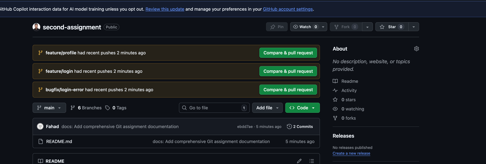

# Git Workflow Assignment

Advanced Git workflow — branching, merge, rebase, and history cleanup.

**Repo:** https://github.com/Fahad0907/second-assignment

---

## Task 1 — Repository Setup

```bash
git init
git config user.name "Fahad"
git config user.email "fahad@example.com"

git add README.md
git commit -m "Initial commit: Project setup"

git branch develop
git branch feature/login
```

Created three branches: `main`, `develop`, `feature/login`.

---

## Task 2 — Branching Workflow

```bash
# Create feature and bugfix branches
git branch feature/payment
git branch feature/profile
git branch bugfix/login-error
```

### Merge (--no-ff)

```bash
git checkout develop
git merge feature/payment --no-ff -m "Merge feature/payment into develop"
```

`--no-ff` keeps a merge commit in history so you can see exactly when a feature was integrated. Without it, Git does a fast-forward and the branch history disappears.

### Rebase

```bash
git checkout feature/profile
git rebase develop
```

Rebase replays your commits on top of `develop`. The result is a straight, linear history — no merge commit, no branching lines in the graph.

**Merge vs Rebase in short:**

| | Merge | Rebase |
|---|---|---|
| History | Shows true branch history | Linear, cleaner |
| Merge commit | Yes | No |
| Safe for shared branches | Yes | No — rewrites commits |

---

## Task 3 — History Cleanup (Interactive Rebase)

Made 6 commits on `feature/login`, then cleaned them up.

```bash
git rebase -i d7cd16c
```

Inside the editor:

```
pick 8a368d8 feat: Create login module structure
squash a3c6d50 feat: Add password hashing utilities
squash 9fad432 feat: Implement signup endpoint
squash 87de98b feat: Add user model and creation logic
pick 82f94a2 test: Add unit tests for authentication
reword f48603a docs: Complete login feature documentation
```

**Squash** — combines multiple commits into one. Good for cleaning up WIP commits before merging.

**Reword** — edits a commit message without touching the code. Useful when you need to follow a naming convention after the fact.

Result: 6 messy commits → 3 clean ones.

---

## Screenshots

### Pull Request / Merge



---

## Push to Remote

```bash
git remote add origin git@github.com:Fahad0907/second-assignment.git

git push -u origin main
git push -u origin develop
git push -u origin feature/login
git push -u origin feature/payment
git push -u origin feature/profile
git push -u origin bugfix/login-error
```